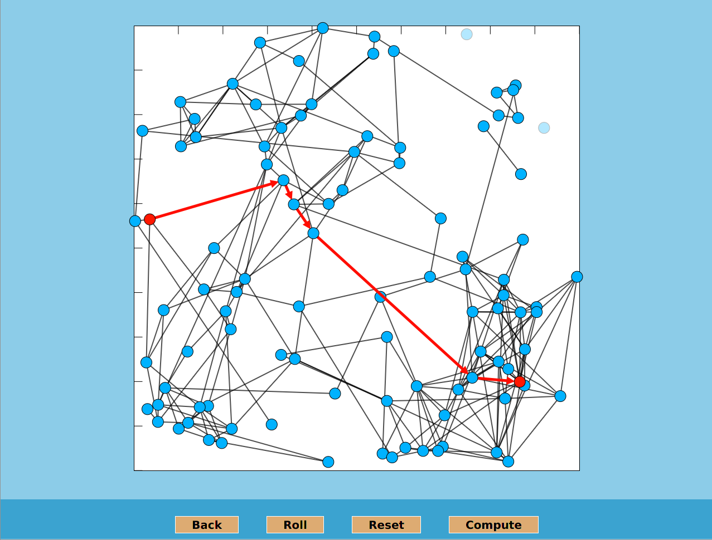

# A* algorithm visualised in JavaFX2
A TODO project for learning JavaFX

# Installation

Simply run:

    gradlew run
  
# Requirements:

- JKD1.8+

# Usage

## Parameters

- N

  It is equal to the number of nodes.
  Typical range: 1 - 200
  
- R

  It is used to compute the chance of a link between two random nodes.
  Typical range: 0.01 - 1.0
  
## Screenshot

